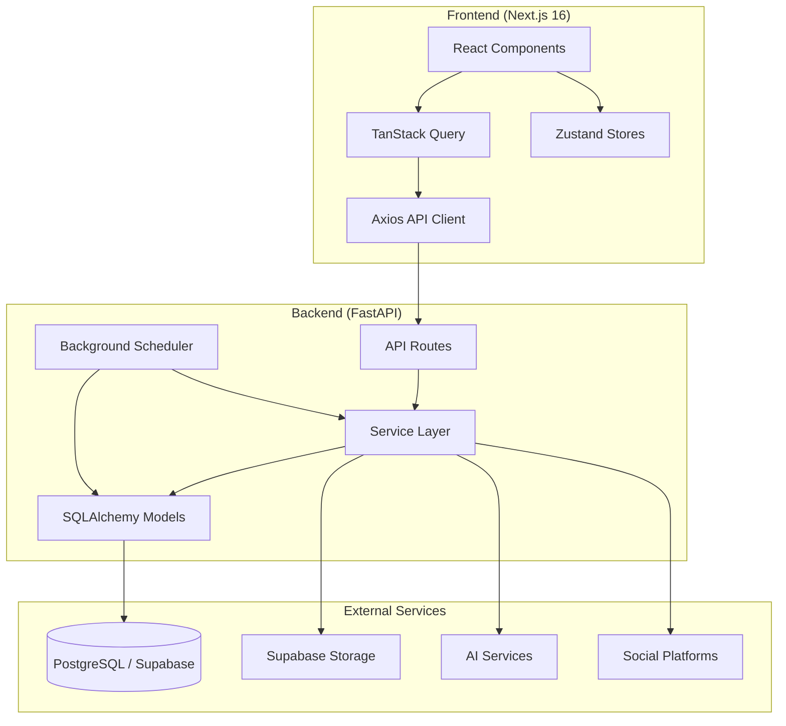
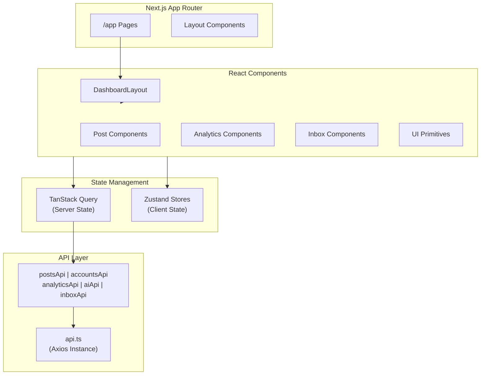
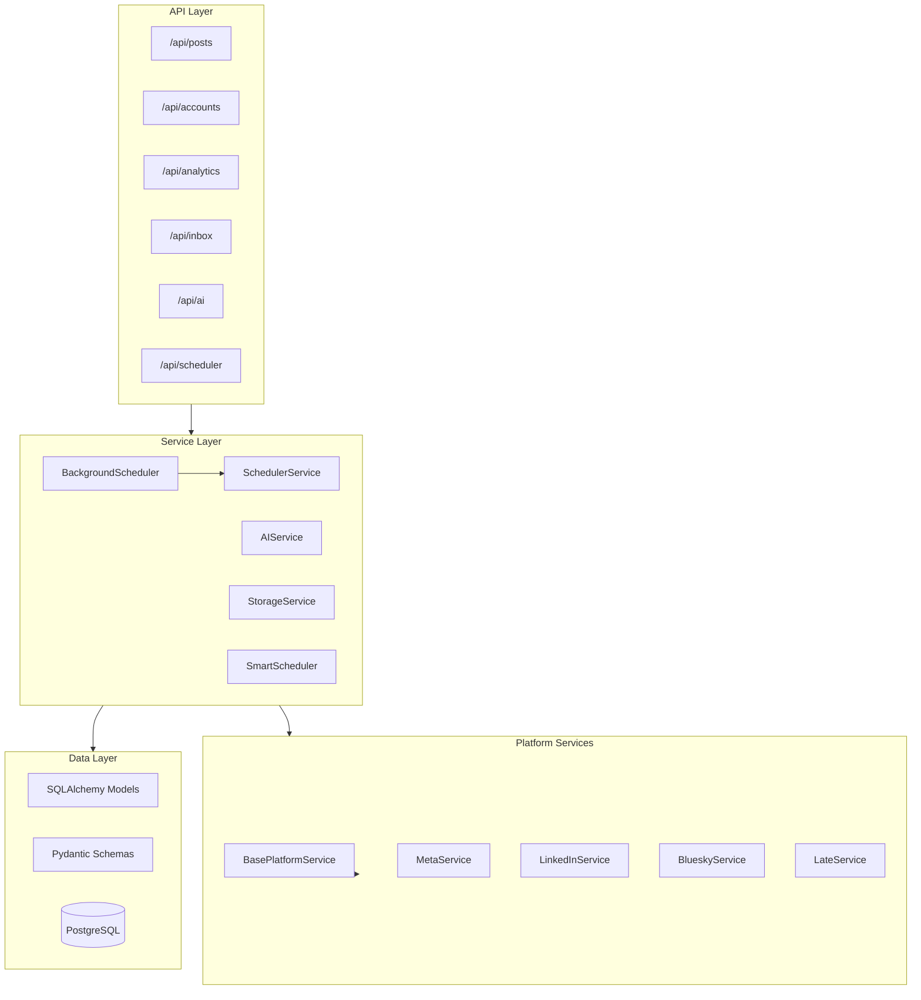
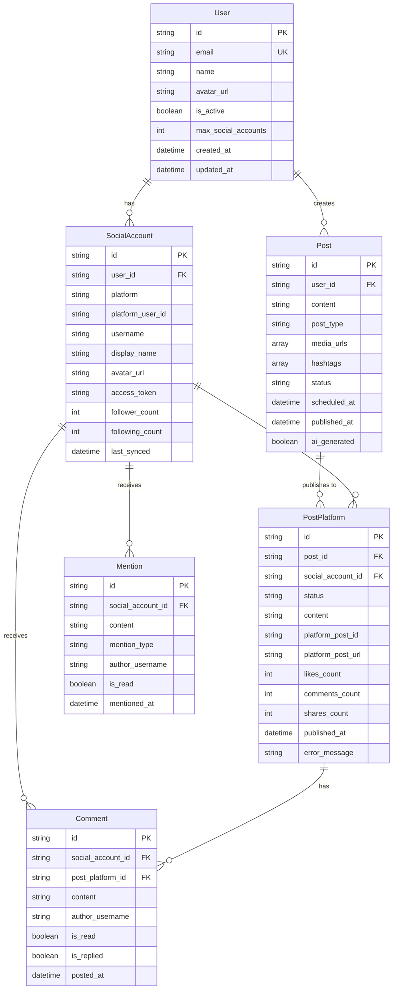
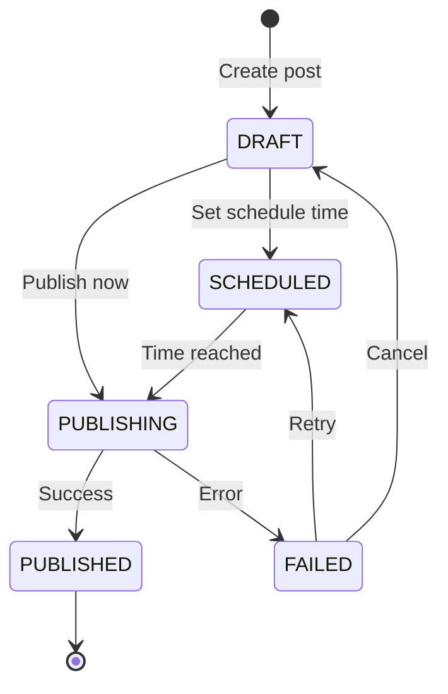
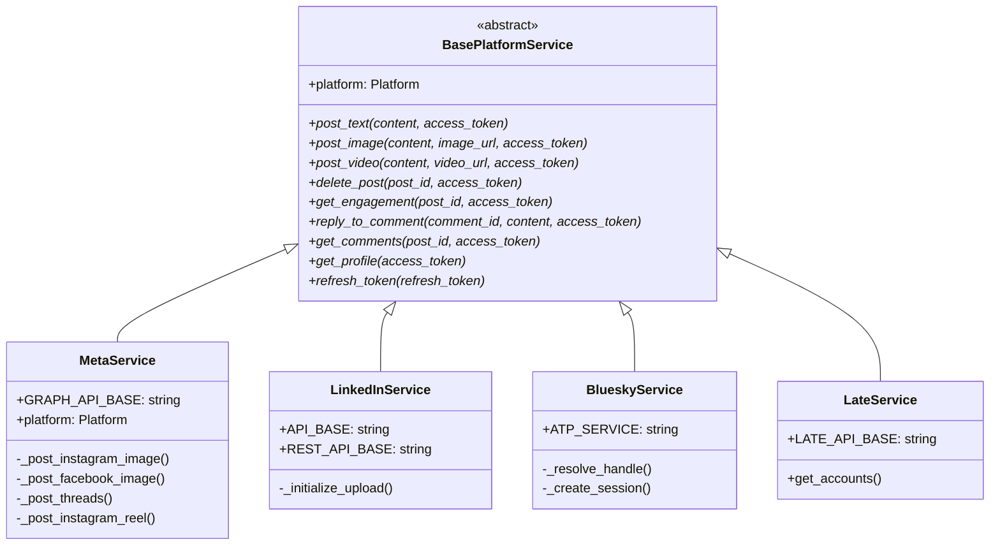
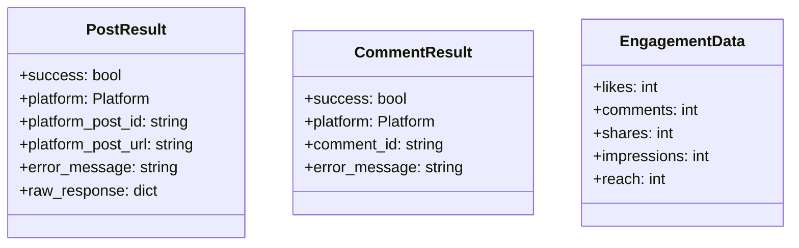
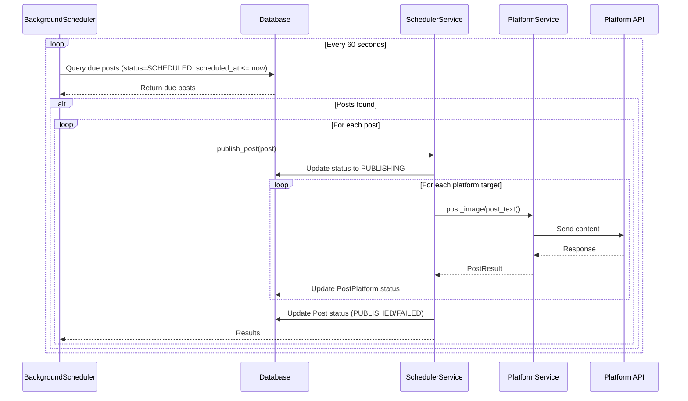
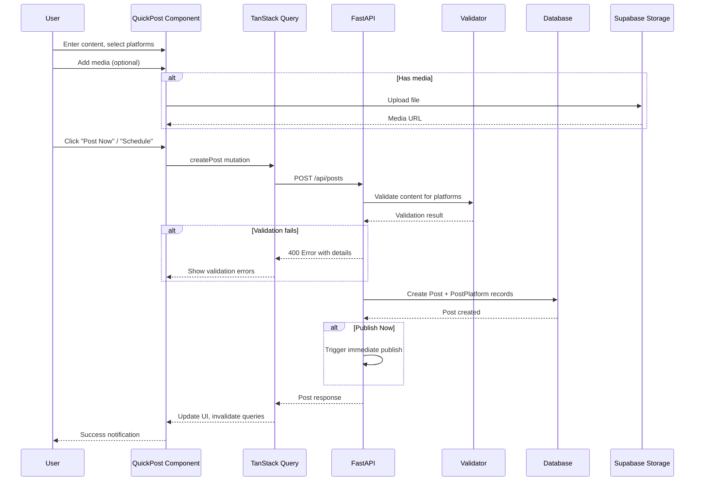
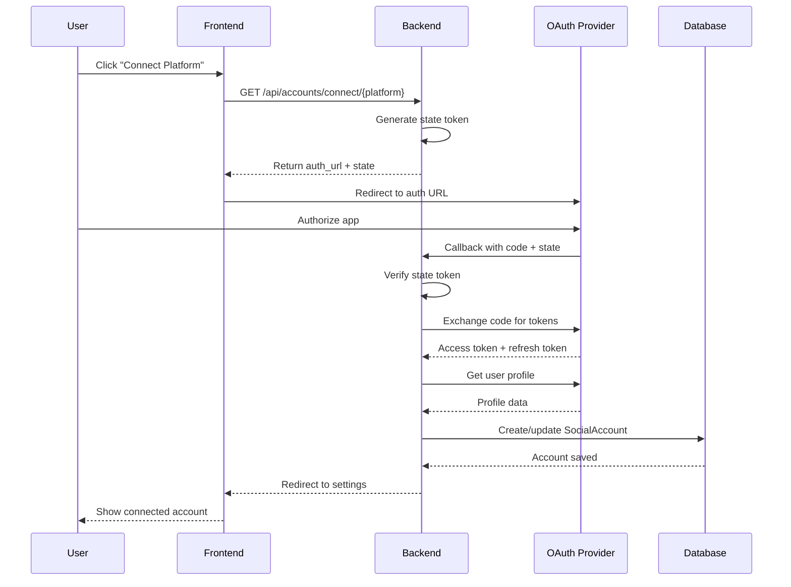

# Apulu Suite Architecture

This document provides a comprehensive overview of the Apulu Suite system architecture, including component relationships, data flows, and design patterns.

## System Overview

Apulu Suite is a social media management dashboard designed for solopreneurs. It enables scheduling, cross-posting, and analytics across 7 platforms: Instagram, Facebook, X (Twitter), Bluesky, TikTok, Threads, and LinkedIn.

## High-Level Architecture

## Component Architecture

### Frontend Architecture

**Key Frontend Technologies:**

| Component | Technology | Purpose |
|-----------|------------|---------|
| Framework | Next.js 16.1.6 | Server-side rendering, App Router |
| UI Library | React 19 | Component-based UI |
| Styling | Tailwind CSS | Utility-first styling |
| Server State | TanStack Query v5 | Data fetching, caching |
| Client State | Zustand | Global UI state |
| HTTP Client | Axios | API communication |
| Icons | Lucide React | Icon library |

### Backend Architecture

## Data Models

### Entity Relationship Diagram

### Post Status Flow

## Platform Service Abstraction

The platform service pattern uses the Strategy pattern to abstract platform-specific implementations behind a common interface.

### Class Hierarchy

### Result Types

## Background Scheduler Flow

The background scheduler handles automatic publishing of scheduled posts.

## Data Flow Diagrams

### Post Creation Flow

### OAuth Connection Flow

## Technology Stack Summary

### Backend Stack

| Layer | Technology | Version |
|-------|------------|---------|
| Framework | FastAPI | Latest |
| Runtime | Python | 3.12 |
| ORM | SQLAlchemy | 2.0 |
| Database | PostgreSQL | Via Supabase |
| Async Driver | asyncpg | Latest |
| HTTP Client | httpx | Latest |
| Validation | Pydantic | v2 |
| Migrations | Alembic | Latest |

### Frontend Stack

| Layer | Technology | Version |
|-------|------------|---------|
| Framework | Next.js | 16.1.6 |
| Language | TypeScript | 5.x |
| UI Library | React | 19.x |
| Styling | Tailwind CSS | 4.x |
| State (Server) | TanStack Query | 5.x |
| State (Client) | Zustand | Latest |
| HTTP Client | Axios | Latest |
| Notifications | React Hot Toast | Latest |

### Infrastructure

| Component | Service |
|-----------|---------|
| Database | Supabase PostgreSQL |
| File Storage | Supabase Storage |
| AI Services | OpenAI / Anthropic Claude |
| Containerization | Docker / Docker Compose |

## Security Considerations

1. **OAuth State Tokens**: Temporary state tokens prevent CSRF attacks during OAuth flows
2. **Token Storage**: Access tokens stored encrypted in database (production recommendation)
3. **API Key Management**: Environment variables for sensitive credentials
4. **Input Validation**: Pydantic schemas validate all input data
5. **Platform-Specific Validation**: Content validated against platform requirements before posting

## Scalability Notes

1. **Background Scheduler**: Runs as asyncio task; for high-volume, consider Celery or similar
2. **Database Connections**: Async session with connection pooling via SQLAlchemy
3. **Cursor Pagination**: O(1) pagination for large post lists
4. **Media Processing**: Images auto-cropped on upload; consider queueing for high volume
5. **Rate Limiting**: Platform APIs have rate limits; implement backoff strategies in production
